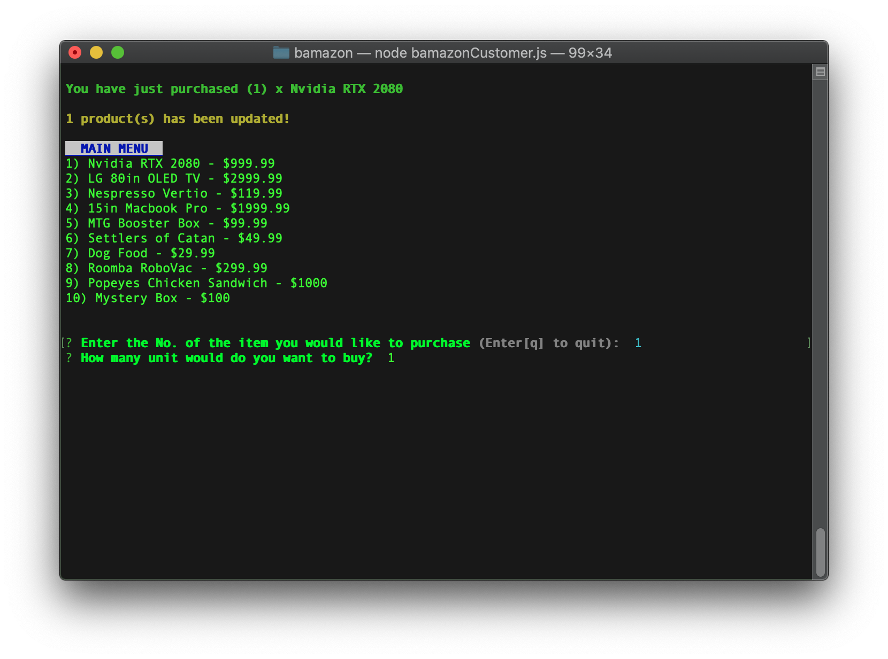
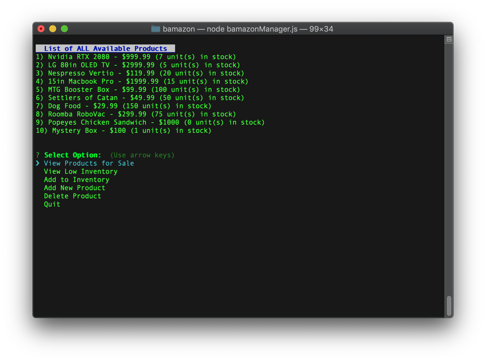
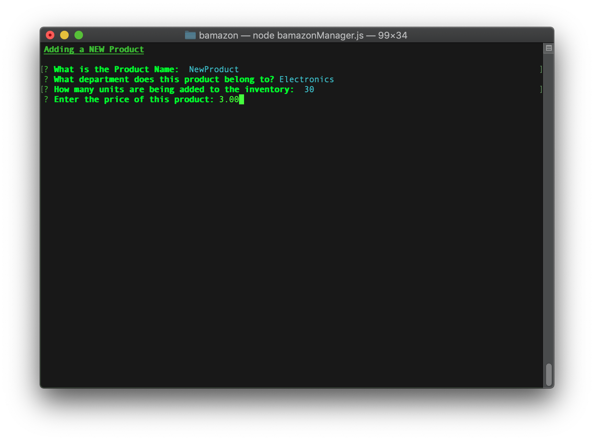
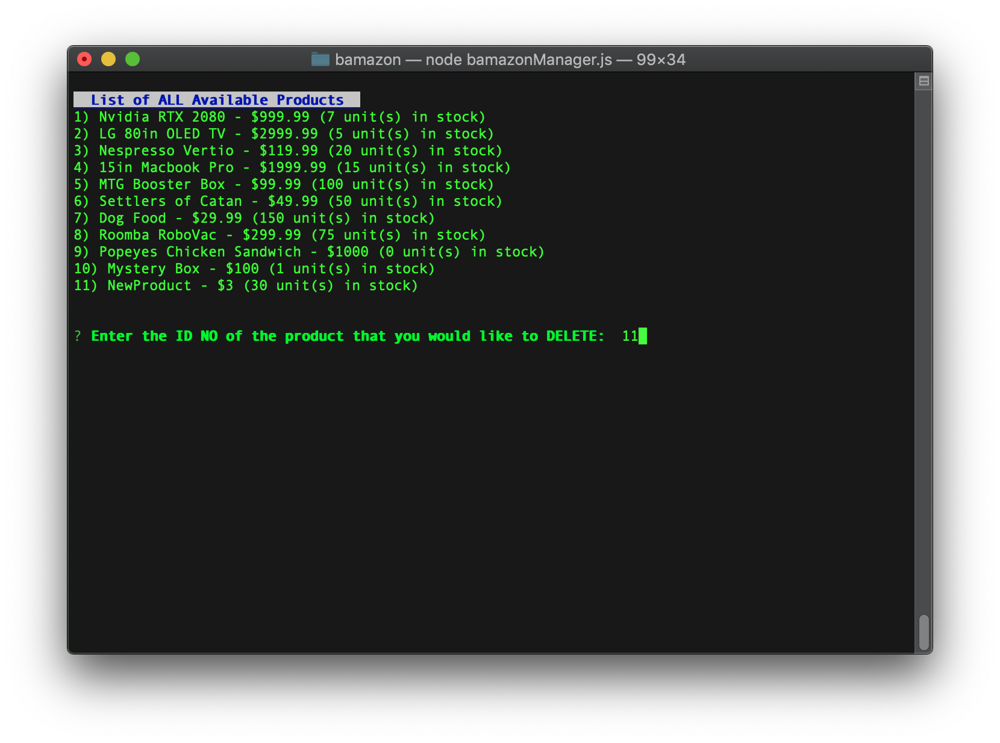
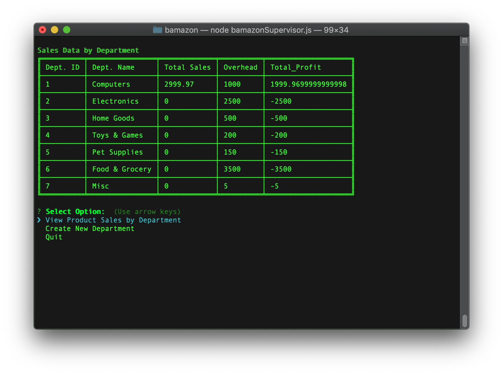
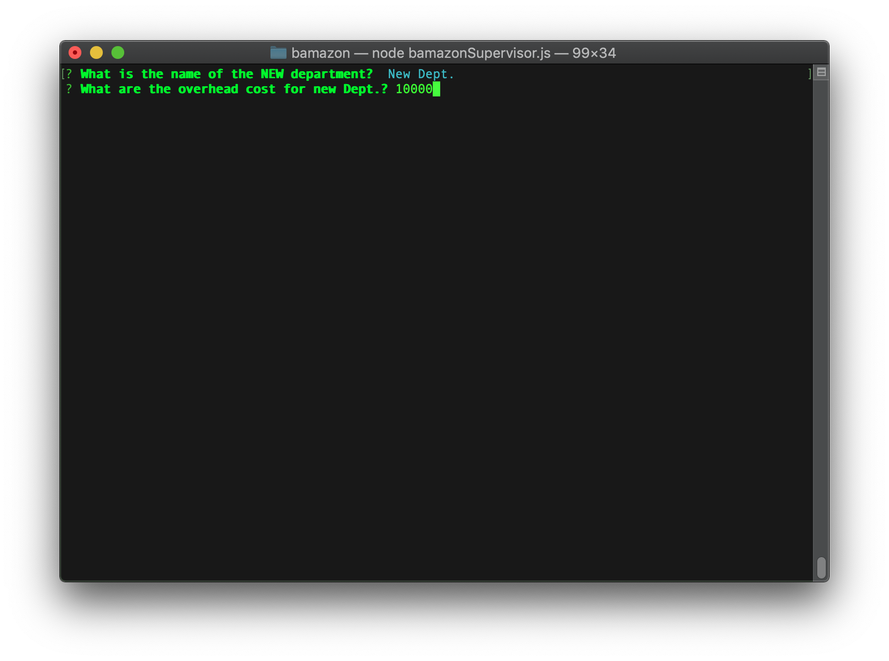

# BAMAZON
#### A CLI Amazon style app...sort of?!?
This Store contains a MySQL Database that contains Products and Store Departments. The Store is made up of 3 different apps:
* [Customer App](#cust-app)
* [Manager App](#man-app)
* [Supervisor Interface](#sup-app)

## Installation
### Requirements
* MySQL
* MySQL Workbench(optional)
* Node.js

### Setup
1. Clone repo locally to your machine
2. Rename the sample.env -> .env
3. Edit the .env file and fill out relevant database info
4. Execute the contents of *bamazon.sql* in MySQL Workbench to create database
5. Execute the contents of *bamazon_seeds.sql* to create inital data in DB
6. Run `npm i` to install neccessary node packages
7. Run one of the following commands:
    1. `node bamazonCustomer.js` - Runs the [Customer App](#cust-app)
    2. `node bamazonManager.js` - Runs the [Manager App](#man-app)
    3. `node bamazonSupervisor.js` - Runs the [Supervisor Interface](#sup-app)
    
## Usage
### Customer App
When the customer app is run it will print a list of Products in from the database that are for sale, along with it's price. 

The user is then prompted to enter the product number of the item they want to purchase, then to enter how many units of that Product they would like to purchase.

If there is not enough stock to fullful the order, a message is displayed to the user, otherwise the order if fulfilled and subtracted from the inventory. Then the user is returned to the main menu to make other purchase or quit.

### Manager App
The Manager Ap allows a store manager to:
* View Products for Sale

* View any Products that have low inventory
* Add more Inventory to existing Products
* Add a new Product

* Delete a product

### Supervisor App
The Supervisor App has the following features:
* View sales and profits by Department

* Create a new Department

